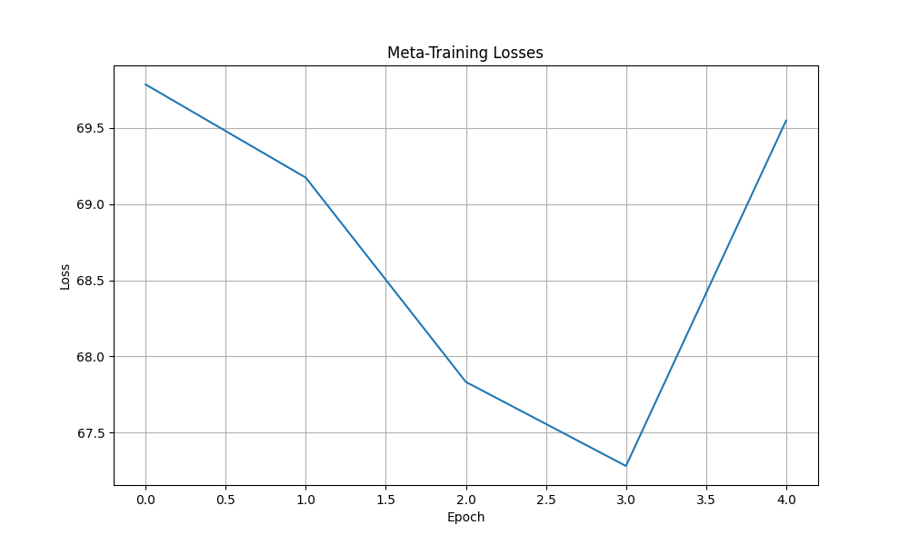
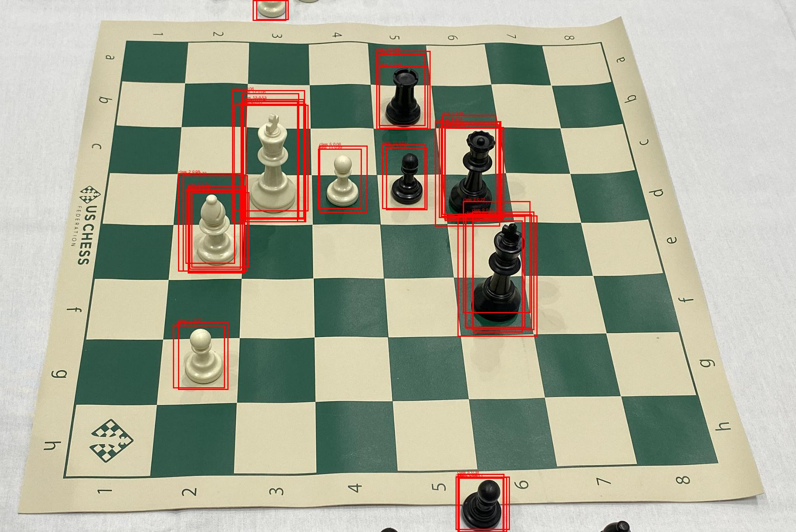
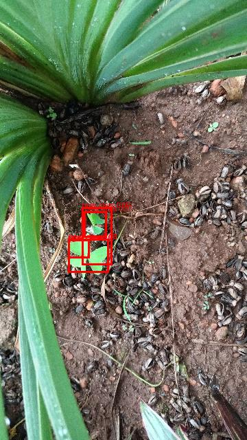

# Few-Shot Object Detection with Faster R-CNN

This project implements a meta-learning approach for few-shot object detection using Faster R-CNN. It enables the model to learn new object classes with very few training examples by leveraging meta-learning techniques.

## Overview

The system consists of two main phases:
1. **Generalization Phase (Meta-Training)**: The model learns to quickly adapt to new object classes by learning general patterns and features that are transferable across different object categories
2. **Adaptation Phase**: The generalized model is adapted to recognize new classes with very few examples (typically 1-5 shots)

## Features

- Meta-learning based few-shot object detection
- Support for COCO format datasets
- Easy adaptation to new classes with minimal examples
- Inference capabilities with visualization
- Performance visualization graphs for meta-learning and few-shot learning

## Requirements

- Python 3.8+
- PyTorch 2.7.0
- CUDA 11.8 (for GPU support)
- Other dependencies listed in `requirements.txt`

## Installation

1. Clone the repository
2. Install dependencies:
```bash
pip install -r requirements.txt
```

## Project Structure

```
C:/Users/User/Desktop/few_shot_detection/FasterRCNN_FewShotLearning/
├── config/             # Configuration files
├── models/            # Model definitions
├── src/               # Source code
│   ├── data/         # Dataset handling
│   ├── models/       # Model implementations
│   ├── training/     # Training logic
│   ├── inference/    # Inference code
│   └── utils/        # Utility functions
├── outputs/          # Training outputs and results
├── NewClassData/     # Data for new classes
├── main.py           # Main entry point
└── requirements.txt  # Project dependencies
```

## Usage

### 1. Generalization Phase (Meta-Training)

Train the model to learn generalizable features:

```bash
python main.py --mode meta-train --config config/config.yaml
```

### 2. Adaptation Phase

There are two types of adaptation approaches:

#### Type 1: Full Data Adaptation
Adapt the model using all available data for the new classes:

```bash
python main.py --mode new-class --config config/config.yaml
```

#### Type 2: Few-Shot Adaptation
Adapt the model using few-shot learning with unseen query data:

```bash
python main.py --mode new-class2 --config config/config.yaml
```

### 3. Inference

Run inference on new images:

```bash
python main.py --mode infer --config config/config.yaml
```

## Configuration

The project uses YAML configuration files to manage parameters. Here are the required parameters for each mode:

### General Settings (All Modes)
```yaml
general:
  device: "cuda"  # or "cpu"
  random_seed: 42
```

### 1. Generalization Phase (Meta-Training)
```yaml
paths:
  meta_trained_model: "/models/fasterrcnn_meta_trained.pth"

dataset:
  meta_train:
    json_path: "data/coco/annotations.json"
    images_path: "data/coco/train2017"

model:
  backbone: "fasterrcnn_resnet50_fpn"

meta_learning:
  num_epochs: 50
  ways: 20  # N-way classification
  shots: 15  # K-shot learning
  batch_size: 2
  lr: 0.0001
```

### 2. Adaptation Phase Configurations

#### Type 1: Full Data Adaptation
```yaml
paths:
  meta_trained_model: "models/fasterrcnn_meta_trained.pth"

dataset:
    new_class:

      json_path:"NewClassData/test2/_annotations.coco.json"  # Path to new class COCO JSON
      images_path:"NewClassData/test2/support"  # Path to new class images folder
      test_images_folder:"NewClassData/test2/query"  # Path to test images folder


fine_tuning:
  num_epochs: 20
  batch_size: 4
  lr: 0.001
  momentum: 0.9
  num_classes: 12
```

#### Type 2: Few-Shot Adaptation
```yaml
paths:
  meta_trained_model: "models/fasterrcnn_meta_trained.pth"

dataset:
    new_class:

      json_path:"NewClassData/test2/_annotations.coco.json"  # Path to new class COCO JSON
      images_path:"NewClassData/test2/support"  # Path to new class images folder
      test_images_folder:"NewClassData/test2/query"  # Path to test images folder

few_shot_adaptation:
  num_epochs: 10
  batch_size: 2
  lr: 0.005
  momentum: 0.9
  num_classes: 12
  ways: 10
  shots: 10        # Number of classes to adapt to
```

### 3. Inference Mode
```yaml
paths:
  fine_tuned_model: "models/adapted_model.pth"

inference:
  image_path: "NewClassData/test"
  conf_threshold: 0.5
  batch_size: 1
  save_visualizations: true
```

### Important Notes:
1. For Generalization Phase:
   - Requires COCO format dataset
   - `ways` and `shots` parameters determine the few-shot learning setup
   - Higher `ways` and `shots` values require more GPU memory
   - Focuses on learning transferable features across different object categories

2. For Adaptation Phase:
   - Type 1 (Full Data Adaptation):
     - Uses all available data for training
     - Includes validation split for monitoring performance
     - Suitable when you have sufficient data for new classes
     - Better for final model deployment

   - Type 2 (Few-Shot Adaptation):
     - Uses limited support data for adaptation
     - Evaluates on unseen query data
     - Suitable for scenarios with limited data
     - Tests model's few-shot learning capabilities
     - Support data should be in COCO format
     - Query data can be unannotated

3. For inference:
   - Can process single images or directories
   - Adjust `conf_threshold` to control detection confidence
   - Set `save_visualizations` to save annotated images

## How It Works

1. **Generalization Phase**:
   - The model learns to quickly adapt to new object classes
   - Uses episodic training with N-way K-shot learning
   - Learns general patterns and features that are transferable across different object categories
   - Leverages Faster R-CNN architecture with meta-learning capabilities

2. **Adaptation Phase**:
   - Takes the generalized model
   - Adapts to new classes using very few examples (support data)
   - Evaluates performance on unseen examples (query data)

3. **Inference**:
   - Performs object detection on new images
   - Supports batch processing
   - Visualizes detection results

## Example of results

### Meta-learning loss on 5 epochs on coco dataset

### More than 1 class


### On 1 class



## Note

**This is an initial version of the code and I welcome collaboration!**

This project is actively being developed and improved. I would be grateful for any contributions, including but not limited to:

- Bug fixes and improvements
- New features and enhancements
- Documentation improvements
- Performance optimizations
- Additional dataset support
- Better visualization tools

Feel free to:
1. Open issues for bugs or feature requests
2. Submit pull requests with improvements
3. Share your results and experiences
4. Suggest new ideas or approaches

Together we can make this few-shot object detection system more robust and useful for the community! 